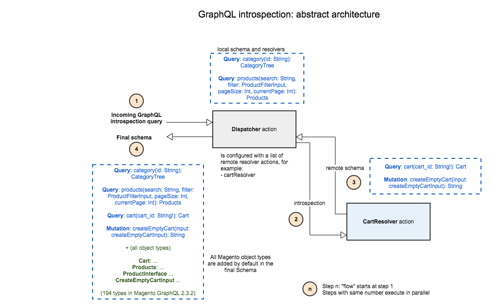
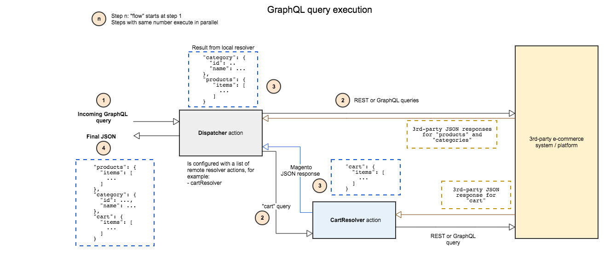

[](https://circleci.com/gh/adobe/commerce-cif-graphql-integration-reference)
[](https://codecov.io/gh/adobe/commerce-cif-graphql-integration-reference)

# 3rd-Party GraphQL integration with AEM Commerce and CIF on Adobe I/O Runtime

## Pre-requisites

Working on 3rd-party integration requires that you are **absolutely** familiar with the following pre-requisites.
* GraphQL: how schemas are defined, what resolvers are and how to write resolvers
    * GraphQL basics: https://graphql.org/learn/
    * GraphQL schema: https://graphql.org/learn/schema/
    * GraphQL resolvers: https://graphql.org/learn/execution/
* Adobe I/O Runtime: how to write, deploy, and get the logs of actions
    * Read the [developer documentation](https://www.adobe.io/apis/experienceplatform/runtime/docs.html)
    * Check the [public developer forum](https://experienceleaguecommunities.adobe.com/t5/adobe-i-o-runtime/ct-p/adobe-io-runtime)
* Make sure you also get used to schema introspection, and how to write and test GraphQL queries
    * GraphQL introspection: https://graphql.org/learn/introspection/
    * Tools: install the ChromeiQL/GraphiQL extension for the Chrome browser
* Get familiar with the Magento GraphQL schema and the types of queries you can make
    * Magento GraphQL documentation: https://devdocs.magento.com/guides/v2.4/graphql/index.html

You can also read our [Medium article](https://medium.com/adobetech/serverless-graphql-on-adobe-i-o-runtime-e221d2a8e215) to get an overall description of the design of the 3rd-party GraphQL integration with AEM Commerce.

## Expectations (please read this!)

This repository provides a reference implementation **example** that can be used as a **starting point** to develop a real integration. This is NOT a complete implementation that supports all the GraphQL queries of the CIF components and connector. Do not expect that it will work OOTB with all the CIF components: there is no point that we implement a full example mock implementation, this is just demonstrating how one should/can develop a real integration.

**Very important**: in order to help a developer, identify what GraphQL queries are sent by the CIF components and connector, this repository also contains a "pruned" Magento schema that only contains the fields being queried by the CIF components and connector. This schema hence represents the fields of the Magento schema that must be implemented by a real integration to fully support all the CIF GraphQL queries. Make sure you read this [documentation](#schema-documentation).

## Introduction

The [AEM CIF Core Components](https://github.com/adobe/aem-core-cif-components) together with the [AEM CIF Add-On](https://experienceleague.adobe.com/docs/experience-manager-cloud-service/content-and-commerce/home.html) offer authoring and frontend integration between AEM (Adobe Experience Manager) and Adobe Commerce. This integration is based on the [Magento GraphQL API](https://devdocs.magento.com/guides/v2.4/graphql/index.html) which offers a very flexible and efficient integration point between AEM and Adobe Commerce.

CIF itself is designed to be open for other commerce solutions as well. In order to support other 3rd-party "non-Adobe" commerce platforms, this project implements an example "reference" implementation that demonstrates how a 3rd-party commerce platform can be integrated with the CIF GraphQL connector and the AEM CIF Core Components via the Magento GraphQL API. Note that the integration is currently based on the GraphQL API of Magento 2.4.2.

This enables customers to reuse our existing connector and components in their project by simply exposing the Magento GraphQL API on top of any 3rd-party commerce platform. To offer maximum flexibility and scalability, this "adaptation layer" is deployed on the serverless [Adobe I/O Runtime](https://www.adobe.io/apis/experienceplatform/runtime.html) platform.

## Getting Started

### Project structure

This project is an application to be deployed to [Adobe Developer App Builder](https://www.adobe.io/app-builder/).

The GraphQL implementation is organized around [GraphQL resolvers](https://graphql.org/learn/execution/#root-fields-resolvers). Each resolver is either "local" or "remote". A "local" resolver is deployed and executed in the main Adobe I/O action that processes incoming GraphQL requests: we call this action the `dispatcher`. In contrast, a "remote" resolver is deployed as a separate Adobe I/O Runtime action which is referenced in the dispatcher action configuration and integrated via [schema delegation](https://www.apollographql.com/docs/graphql-tools/schema-delegation/).

All GraphQL function code is organized in the `actions` folder.

```
actions
├── common
├── documentation
├── local
   ├── dispatcher
├── remote
   ├── cartResolver
...
web-src
```

The `common` folder contains all the code that fetches and converts 3rd-party data into the GraphQL format. These classes can be used either by the local dispatcher action or by remote resolvers.

The `documentation` folder contains some code that is used to generate a subset of the Magento schema that covers all the queries required by the CIF integration. This is **not** used by the resolvers, see the [Schema documentation](#schema-documentation) section below.

Within the `web-src` folder we provide a mini web application which loads the [GraphiQL](https://github.com/graphql/graphiql) GraphQL client. It allows you to immediately try out the GraphQL actions of the project.

For a detailed description of the project folder and file structure see [App Builder getting started documentation](https://www.adobe.io/app-builder/docs/getting_started/).

### Local vs. remote resolvers

The main benefit of having local resolvers is that they all belong to the same `nodejs` process and hence can share data caches in order to optimise the fetching of data. In contrast, a remote resolver executes in a separate action in Adobe I/O Runtime, which means that it cannot share any data cache with the local resolvers. Each remote resolver is integrated with the dispatcher action and the local resolvers via [schema delegation](https://www.apollographql.com/docs/graphql-tools/schema-delegation/) where it implements a sub-part of the entire schema and acts like a remote GraphQL schema. The main benefit of remote resolvers/schemas is that they offer a flexible extensibility pattern to either customize the default Magento GraphQL schema or extend it with extra features. It is also possible to override a local resolver with a remote resolver, for example to customize a resolver on a project basis. 

Note that the loader and data classes in this project are developed in a way so that they can be used in local or remote resolvers. We strongly advise that a real implementation follows the same development pattern.

## Architecture

The following diagram illustrates the architecture of this reference implementation. It shows how introspection is performed in order to build the final entire schema. Some part of the final schema is "provided" by the `cartResolver` action.



This second diagram illustrates how a GraphQL query is being executed. The `cart` part of the query is delegated to the `cartResolver`. All the JSON responses are merged by the `dispatcher` action in order to build the full response.



## How to build, test, and deploy

### Versioning

The code in this repository is not released in NPM because it is not meant to be reused as a dependency in some other project. However, we add git tags in the format `cif-x.y.z` to label the commit where, for example, the code is compatible with version `1.0.0` of the CIF components and connector. This should hopefully help developers to follow and identify the changes required by each new CIF release in order to integrate with a 3rd-party commerce platform. 

### Tools

Make sure you have the following tools installed:
* Node 12.x
* NPM 6.x
* [Adobe I/O CLI](https://github.com/adobe/aio-cli)

To setup you local environment follow the [App Builder](https://www.adobe.io/app-builder/docs/getting_started/) documentation.

### Getting started

This project is provided as a blueprint, to deploy and run the functions on Adobe I/O Runtime you need to make it your own and attach it to your Adobe I/O Project. This requires creating a project on [Adobe Developer Console](https://console.adobe.io/), setting up and login from the CLI and connecting your project. Follow the steps 1 - 3 of the [Creating your first App Builder Application](https://www.adobe.io/app-builder/docs/getting_started/first_app/) guide.

Once done connect the cloned project with you Adobe I/O project:

```bash
$ aio app use
```

The CLI will guide you through the selection of Organization, Project and Workspace that you'd like to use for this App Builder application.

### Build & Deployment

To install all the npm dependencies, if not already done, and then execute all the unit tests, simply run:

```bash
$ npm install
$ aio app test
```

To deploy the application on the Adobe I/O platform simply run:

```bash
$ aio app deploy
```

This will build and deploy the GraphQl functions and web frontend. The CLI will print out the deployed functions in you I/O Runtime namespace including the URL to access them. The dispatcher is a web action that is accessible with the URL `https://<PROJECT_NAME>.adobeio-static.net/api/v1/web/commerce-cif-graphql-integration-reference-1.0.0/dispatcher`.

To test the GraphQL endpoint directly open the GraphiQL to test some GraphQL queries. The URL for your GraphiQL instance is printed out by the AIO CLI during the deployment. Any other GraphQL client will work as well.

## Developing a real 3rd-party integration

This repository provides a reference implementation that can be used as a starting point to develop a real integration with a 3rd-party commerce system. In order to implement a real integration, one will have to:
* modify all the `*Loader.js` classes so that they would fetch data via the 3rd-party commerce system (the loaders currently return some "dummy" example data)
* modify all the `__convertData` conversion methods in the data classes, to convert the data from the 3rd-party system into Magento GraphQL objects
* modify and extend the `getter` methods in the data classes, to support all the fields not covered by the example integration
* introduce new local and/or remote resolvers, to incrementally support more fields of the Magento GraphQL API
* modify the GraphQL schema to only expose the implemented fields and any potential schema customization(s) and/or extension(s)

## Schema customization and/or extension

With GraphQL introspection, it is very easy for users to discover and browse a GraphQL schema in order to understand the types of queries it supports. Since the goal of the 3rd-party integration is to adapt the Magento GraphQL schema to "non-Adobe" e-commerce platforms, it is clear that:

* it is not realistic to expect that the entire Magento schema can be adapted at once
* there might be incompabilities between the Magento GraphQL and a 3rd-party platform
* it must be possible to extend the base Magento schema with custom attributes and fields

In order to illustrate these requirements, the `localSchema()` function in [dispatcher.js](src/local/dispatcher.js) demonstrates a number of possible changes applied to the GraphQL schema. This is of course only an example, and a real implementation should either remove all the customizations if none is needed, or adapt the examples to satisfy the customizations and extensions required by the real integration. We however recommend that a real implementation should remove all the fields that it doesn't implement (at least for the top-level fields under the `Query` and `Mutation` root types), so that the schema only contains the parts of the Magento schema that are really implemented and supported.

## Schema documentation

As stated in the previous section, GraphQL introspection allows users to discover and browse a GraphQL schema in order to understand the types of queries it supports. When implementing a 3rd-party integration and because the Magento schema is large, it is important that one understands the parts of the Magento schema that are actually used by the CIF connector and components. To document this, we have implemented a tool that uses the GraphQL queries used by the CIF connector and components in order to create the subset of the Magento schema that MUST be implemented in order to support the CIF connector and components.

This "pruned" schema is automatically generated and included in this repository. If needed, one can regenerate it by running `npm run doc`. Note that this requires that you have the [jq](https://github.com/stedolan/jq) tool installed on your machine.

To introspect this schema, it is automatically deployed when running `aio app deploy` in a web action called `cif-schema`. Using a GraphQL introspection tool like the included `GraphiQL`, one can then easily browse the pruned schema at the `https://adobeioruntime.net/api/v1/web/NAMESPACE/graphql-reference/cif-schema` URL. This action only supports introspection, so you cannot execute any query. It however documents all the fields and types that are currently being used by the CIF connector and components.

## Caching

For performance reasons, the [dispatcher.js](src/local/dispatcher.js) implementation "caches" the GraphQL schema in a global variable, so that further WARM invocations of the same action can immediately reuse the schema previously built with schema stitching. The Adobe I/O Runtime platform indeed reuses existing `Node.js` containers when possible, so it is possible to "cache" data in global variables.

In addition, the dispatcher implementation also demonstrates the use of the [aio-lib-state](https://github.com/adobe/aio-lib-state) library in order to cache all the remote schemas in a cache maintained by the Adobe I/O platform. This cache is used as a second-level caching layer when a COLD container is used, and its usefulness increases with the number of remote resolvers. The cache is disabled by default and has to be explicitly activated by developers.

This caching is activated/disabled by the `use-aio-cache` property set in [manifest.yml](manifest.yml). To activate the caching, set this property to an integer value that will define the caching duration in seconds. During development, we **strongly recommend** that this property is set to `false` to make sure that changes to the schema are immediately visible in the schema.

### Contributing

Contributions are welcomed! Read the [Contributing Guide](.github/CONTRIBUTING.md) for more information.

### Licensing

This project is licensed under the Apache V2 License. See [LICENSE](LICENSE) for more information.
